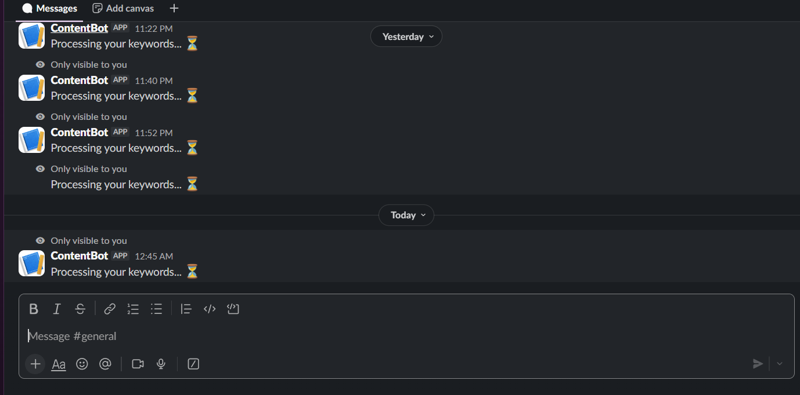
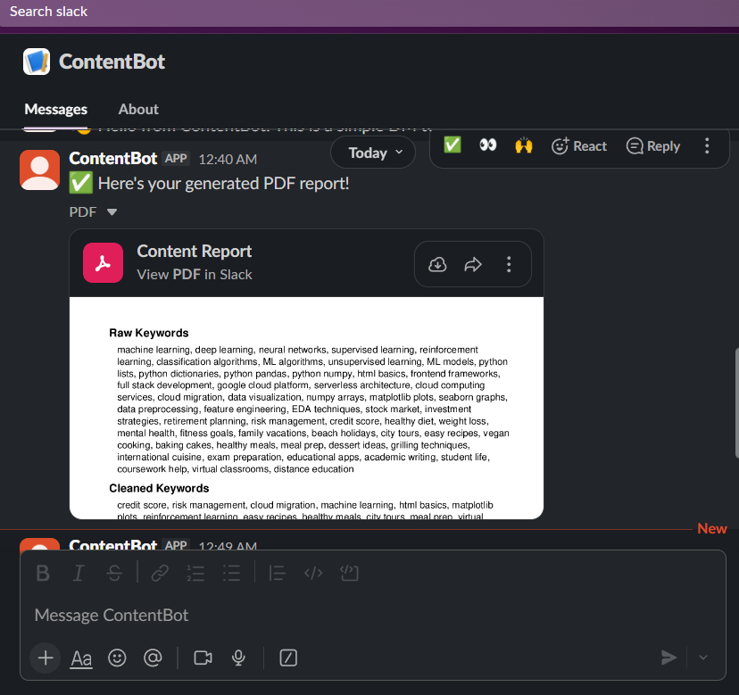

# 📌 SlackBot Content Pipeline Workflow

This document explains the end-to-end workflow of the **SlackBot Content Pipeline**, from uploading keywords to receiving a PDF report in Slack.

---

## 1️⃣ Upload Keywords via Slack

Users send keywords using the Slack slash command:

**/upload_keywords**

> "Processing your keywords... ⏳"

> 

This confirms that the pipeline has started.

---

## 2️⃣ Preprocessing Keywords

Once the keywords are received, they are **preprocessed** using the following steps:

- ✅ **Lowercasing**  
- ✅ **Unicode normalization (NFKC)**  
- ✅ **Removing HTML tags**  
- ✅ **Removing emojis**  
- ✅ **Removing punctuation and special characters**  
- ✅ **Splitting into words and keeping only English alphanumeric words**  
- ✅ **Removing extra spaces and empty keywords**

---

## 3️⃣ Embedding Keywords

Preprocessed keywords are converted into embeddings using the **e5-large-v2** model.  

This converts textual keywords into numerical vectors suitable for clustering.

---

## 4️⃣ Dimensionality Reduction

**UMAP** is applied to reduce embedding dimensions, helping visualize and cluster high-dimensional embeddings efficiently.

---

## 5️⃣ Clustering Keywords

**HDBSCAN** is used to cluster the reduced embeddings.  

- Top **3 keywords closest to the centroid** of each cluster are selected for further processing.

---

## 6️⃣ SERP API Search

For each cluster, a **SERPAPI search** is conducted using the top keywords.  

The following information is retrieved for each cluster:

- 📝 **Snippet**  
- 📰 **Heading**  
- 🔗 **Link**

---

## 7️⃣ Generate Outline and Post Idea

Keywords and SERPAPI snippets are passed to the **LLM (Groq API)**.  

The LLM generates:

- 📄 **Structured outline** for the content  
- 💡 **Unique, attention-grabbing post idea**

---

## 8️⃣ Generate PDF Report

All information (keywords, clusters, SERP snippets, outline, post idea) is compiled into a **PDF report**.  

The bot sends the PDF directly to the user’s **private DM** in Slack.

[Download Example PDF Report](assets/content_report.pdf)

---

## 9️⃣ Summary of Workflow

1. User uploads keywords in Slack via `/upload_keywords`.  
2. Bot confirms receipt: "Processing your keywords... ⏳".  
3. Keywords are **preprocessed** for clean text.  
4. Keywords are **embedded** using e5-large-v2.  
5. **Dimensionality reduction** with UMAP.  
6. **Clustering** with HDBSCAN.  
7. Top keywords per cluster are used to **fetch SERPAPI results**.  
8. **LLM** generates outline and post idea for each cluster.  
9. **PDF report** is generated and sent to the user’s **DM** in Slack.

---

### 📂 Assets Folder

- `assets/clustering_example.png` → Visualization of clustered keywords  
- `assets/slack_dm_example.png` → Example Slack DM with PDF  
- `assets/content_report.pdf` → Sample PDF report
